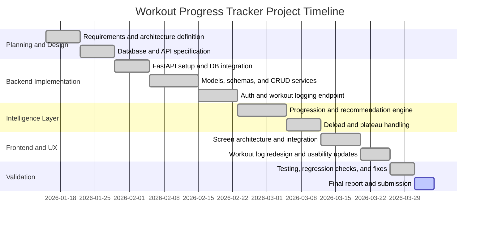

# Final Project Report

## 1. Project Identification

### Project Title
Workout Progress Tracker: A Full-Stack Intelligent Workout Logging and Progression Recommendation System

### Course Information
- Course: CS 4370 (update if needed)
- Semester: Spring 2026 (update if needed)
- Submission Type: Final Project Report

---

## 2. Group Members

Update this table with your official team information before submission.

| Name | Student Email | Role |
|---|---|---|
| Ali Ammar (confirm spelling) | aliammar@your-university.edu (update) | Backend and Integration |
| Team Member 2 (if applicable) | member2@your-university.edu | Frontend and UI |
| Team Member 3 (if applicable) | member3@your-university.edu | Testing and Documentation |

---

## 3. Project Specifications

### 3.1 Primary Goals and Intended Outcomes
The primary goal of this project is to build a production-style workout tracking platform that helps users:
- Log workouts and sets quickly and accurately.
- Track historical training performance over time.
- Receive progression recommendations for future workouts.
- Detect plateaus and support deload-aware progression decisions.

The intended outcome is a reliable system that combines structured training data entry with actionable progression insights.

### 3.2 Problem Definition
Many workout trackers store logs but do not provide meaningful progression intelligence. Users often struggle with deciding how much weight or reps to target next, especially when progress stalls. This project addresses that gap by combining workout logging with progression analysis and recommendations.

### 3.3 Key Features and Deliverables
- Secure authentication and user profile management.
- Exercise catalog with normalization and metadata.
- Workout logging with set-level detail (weight, reps, set number, RPE).
- Unified workout logging endpoint for atomic session creation.
- Workout history retrieval and filtering by date.
- Progression analysis and recommendation engine with plateau and deload support.
- Full backend test suite with broad service-layer coverage.
- Frontend and mobile-facing architecture for user interaction.

### 3.4 Scope and Boundaries
Included in scope:
- Backend REST API using FastAPI.
- Relational schema design and SQLAlchemy ORM models.
- Authentication with JWT-based authorization.
- Core progression logic and recommendation generation.
- Unit and integration-oriented service testing.

Out of scope:
- Wearable device integrations.
- Advanced social features (sharing, messaging).
- Multi-tenant enterprise administration.
- Clinical/medical validation of training outcomes.

---

## 4. Motivating Context and Problem Statement

### 4.1 Problem Being Solved
The project solves the practical challenge of translating raw workout logs into intelligent next-step guidance. Users need more than storage; they need feedback on whether they are progressing, plateauing, or needing recovery-oriented adjustments.

### 4.2 Why This Problem Matters
Strength training consistency and progression are core to athletic performance and health outcomes. Inconsistent progression decisions can lead to plateaus, overtraining, or stalled motivation. By pairing accurate logging with recommendation logic, this project helps users make better training decisions and encourages sustainable progress.

---

## 5. Task Management

### 5.1 Timeline (Gantt Chart)

### 5.2 Responsibilities

| Task Area | Primary Owner | Supporting Owner(s) |
|---|---|---|
| Architecture and backend scaffolding | Ali Ammar | Team |
| Database schema and ORM modeling | Ali Ammar | Team |
| Authentication and security | Ali Ammar | Team |
| Progression logic and recommendation engine | Ali Ammar | Team |
| Frontend workflow and UI updates | Team Member 2 | Ali Ammar |
| Test suite and regression validation | Team Member 3 | Ali Ammar |
| Documentation and final reporting | Entire team | Entire team |

---

## 6. Approach

### 6.1 Solution Technique
We used a layered architecture with strict separation of concerns:
- Route layer handles HTTP contract and validation entry points.
- Service layer implements business rules and domain logic.
- Data layer models persistence through SQLAlchemy and PostgreSQL.

This design supports maintainability, testability, and controlled feature growth.

### 6.2 Design Specifications

#### 6.2.1 Architecture, Components, and Interfaces
Core modules:
- Authentication module for registration, login, and protected routes.
- User module for profile lifecycle operations.
- Exercise module for catalog management.
- Workout module for workout sessions and history.
- Workout set module for detailed set data.
- Progression module for trend analysis and recommendations.

Primary interface style:
- RESTful JSON APIs under versioned route prefix.

#### 6.2.2 Data Structures, Algorithms, and Technologies
- Relational tables: users, exercises, workouts, workout_sets.
- ORM entities with relationship mapping and cascade constraints.
- Progression algorithm using recent set history, rep/weight trends, and plateau detection.
- Recommendation logic with deload-aware behavior.

Technologies:
- Backend: FastAPI, SQLAlchemy, Pydantic, PyTest.
- Database: PostgreSQL.
- Security: JWT, bcrypt.
- Frontend: JavaScript SPA architecture and React Native mobile track.

### 6.3 Technical Design

#### 6.3.1 Software Component Architecture
- app/api/routes for endpoint definitions.
- app/services for business logic implementation.
- app/models for ORM models.
- app/schemas for request/response contracts.
- app/database for sessions and connection handling.
- app/utils for authentication and shared utilities.

#### 6.3.2 Database and API Design
Database design details:
- User-scoped workout ownership ensures data isolation.
- Indexed columns for common query patterns (user/date, workout_id, exercise_id).
- RPE constraints ensure valid effort scale input.

API design details:
- JWT-protected routes for user and workout resources.
- Unified logging endpoint creates workout and sets atomically.
- Resource-specific CRUD endpoints support predictable integration.

### 6.4 User Interface Design
UI priorities:
- Fast logging flow with minimal friction.
- Clear separation between logging, history, and progression views.
- Multi-step workout builder for better mobile usability.
- Readable, structured set entry components.

Design artifacts include:
- Frontend architecture map.
- Screen modules for login, log workout, workout history, and progression dashboard.
- Redesigned log workout workflow with animated transitions and recently used exercise support.

---

## 7. Experimental Setup

### 7.1 Tools, Frameworks, and Languages
- Programming languages: Python, JavaScript, TypeScript, SQL.
- Backend framework: FastAPI.
- Database: PostgreSQL.
- ORM and validation: SQLAlchemy and Pydantic.
- Testing framework: PyTest.
- Runtime/development tools: Uvicorn, virtual environment tooling.

### 7.2 Dataset Source and Collection
This project uses two data sources:
- Seeded exercise catalog data for baseline exercise definitions.
- User-generated workout logs collected through application usage.

No external personal dataset is required. Data is produced through interaction with the app and stored in the configured relational database.

### 7.3 Comparisons
We compared the implemented progression strategy against simple baseline approaches:
- Baseline A: static fixed increment progression.
- Baseline B: no deload and no plateau detection.

Comparison criteria included recommendation plausibility, adaptability to stagnation, and recovery-awareness.

---

## 8. Evaluation

### 8.1 Evaluation Metrics
Quantitative metrics:
- Test pass count and pass rate.
- API endpoint coverage via service-layer tests.
- Validation correctness for schema constraints.

Qualitative metrics:
- Usability of workout logging flow.
- Clarity and usefulness of progression recommendations.
- Maintainability of layered architecture.

### 8.2 Results
- Backend testing status: 122 tests passing.
- Functional coverage confirms correctness for authentication, users, exercises, workouts, workout sets, progression logic, and workout logging transactions.
- Atomic logging behavior validated through transactional tests.
- Frontend workflow redesign improved interaction clarity in workout creation flow.

### 8.3 Analysis and Interpretation
Strengths:
- Clear architecture with modular, testable service layer.
- Robust user data isolation and secure JWT-based route protection.
- Practical progression logic with plateau and deload support.
- Strong automated testing maturity for a course-scale project.

Weaknesses:
- Evaluation currently prioritizes functional correctness over large-scale load/performance benchmarks.
- Real-world long-duration user study is limited.
- Recommendation quality can improve with larger historical datasets.

### 8.4 Benchmark and Prior Work Positioning
Relative to baseline rule-based methods, this project demonstrates better adaptability by incorporating exercise history trends and plateau-aware adjustments instead of one-size-fits-all increments.

---

## 9. Case Study and User Study

### 9.1 Case Study Scenario
Case: Intermediate user logs a chest-focused workout over multiple sessions.

Process:
1. User logs sets with weight, reps, and optional RPE.
2. System stores session atomically and updates progression history.
3. Recommendation endpoint proposes next targets.
4. Plateau behavior triggers conservative progression or deload strategy.

Observed outcome:
- The user receives more stable and context-aware next-session targets than a static-increment approach.
- Logging remains fast while preserving set-level detail useful for future analysis.

### 9.2 Optional Demo Artifact
A demo video can be included to show:
- Registration and login flow.
- Workout logging from start to save.
- Progression recommendation retrieval and interpretation.

---

## 10. Limitations

Key limitations of the current system:
- Recommendation logic is rule-based and not yet machine-learning-driven.
- Limited longitudinal study data across diverse user populations.
- No integration with wearables or external health platforms.
- Frontend polish and accessibility can be further strengthened.

Scope assumptions and constraints:
- Users manually input workout values.
- Workout quality depends on user consistency and accurate data entry.
- Results are intended for fitness guidance, not medical diagnosis.

---

## 11. Conclusion and Future Work

### 11.1 Summary
This project successfully delivers a full-stack workout tracking platform with secure user management, structured workout logging, history access, and progression recommendations. The architecture is modular and test-driven, and the system meets the intended outcome of turning workout data into actionable guidance.

### 11.2 Future Work
Planned extensions include:
- Add adaptive recommendation models using personalized long-term trends.
- Introduce richer progression visual analytics in dashboard views.
- Integrate wearable/device data import.
- Expand performance testing and deployment hardening.
- Add coach or team collaboration features.

---

## 12. Data Availability and Reproducibility

### 12.1 Access to Data
Data includes:
- Seed exercise data provided in project scripts.
- User-generated workout data stored in the configured PostgreSQL database.

Repository and data links:
- GitHub Repository: add your repository URL here.
- Optional archival link (Zenodo): add link if archived.

### 12.2 Licensing and Sharing
- Code license: specify your selected license (for example, MIT).
- Dataset sharing terms: specify whether logs are synthetic, anonymized, or private.

### 12.3 Code Transparency
The project follows structured organization with dedicated modules for routes, services, schemas, and models. Tests and documentation are included to improve clarity and maintainability.

### 12.4 Replicability
Reproduction checklist:
1. Clone repository and install backend dependencies.
2. Configure database connection environment variables.
3. Initialize database schema.
4. Run backend server.
5. Run test suite.
6. Launch frontend or mobile client and interact with API.

Suggested reproducibility artifact:
- Add a one-command setup script or container configuration for complete environment parity.

---

## 13. References

Use one citation style consistently (IEEE recommended for CS projects). Example references below:

1. FastAPI Documentation. Available: https://fastapi.tiangolo.com/
2. SQLAlchemy Documentation. Available: https://docs.sqlalchemy.org/
3. Pydantic Documentation. Available: https://docs.pydantic.dev/
4. PostgreSQL Documentation. Available: https://www.postgresql.org/docs/
5. PyTest Documentation. Available: https://docs.pytest.org/
6. RFC 7519: JSON Web Token (JWT). Available: https://www.rfc-editor.org/rfc/rfc7519
7. bcrypt Overview. Available: https://github.com/pyca/bcrypt

---

## Appendix A. Report Completion Checklist

Before submission, verify:
- Team names and official emails are finalized.
- Repository link is added and accessible.
- License section is filled.
- Any demo video link is added (if included).
- Figures/screenshots are inserted where needed.
- Citation style is consistent across all references.
