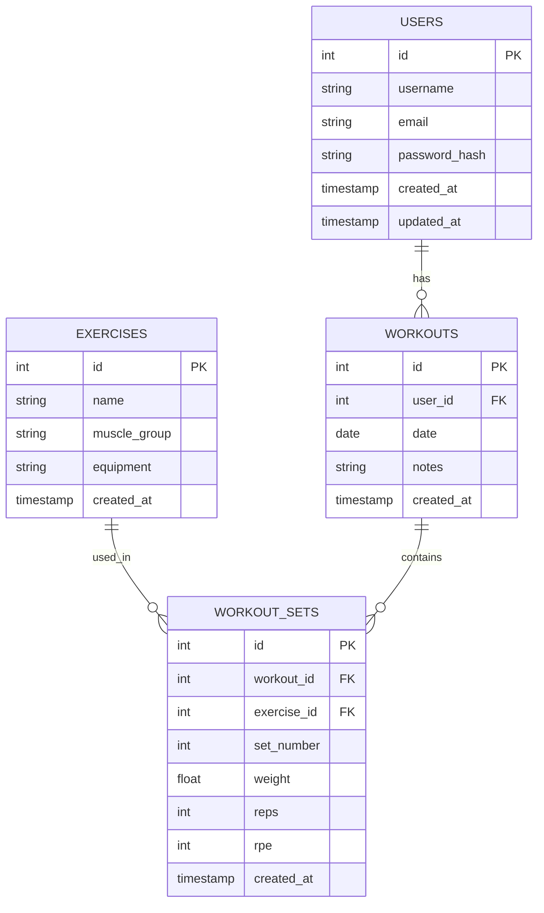

# Database Schema

## Entity Relationship Diagram

## Tables

### users

| Column        | Type         | Constraints                |
|---------------|--------------|----------------------------|
| id            | SERIAL       | PRIMARY KEY                |
| username      | VARCHAR(50)  | NOT NULL, UNIQUE           |
| email         | VARCHAR(255) | NOT NULL, UNIQUE           |
| password_hash | VARCHAR(255) | NOT NULL                   |
| created_at    | TIMESTAMP    | NOT NULL, DEFAULT NOW()    |
| updated_at    | TIMESTAMP    | NOT NULL, DEFAULT NOW()    |

### exercises

| Column       | Type         | Constraints                |
|--------------|--------------|----------------------------|
| id           | SERIAL       | PRIMARY KEY                |
| name         | VARCHAR(100) | NOT NULL, UNIQUE           |
| muscle_group | VARCHAR(50)  | NOT NULL                   |
| equipment    | VARCHAR(50)  | NOT NULL, DEFAULT 'none'   |
| created_at   | TIMESTAMP    | NOT NULL, DEFAULT NOW()    |

### workouts

| Column     | Type      | Constraints                          |
|------------|-----------|--------------------------------------|
| id         | SERIAL    | PRIMARY KEY                          |
| user_id    | INTEGER   | NOT NULL, FK → users.id, ON DELETE CASCADE |
| date       | DATE      | NOT NULL                             |
| notes      | TEXT      | NULLABLE                             |
| created_at | TIMESTAMP | NOT NULL, DEFAULT NOW()              |

### workout_sets

| Column      | Type      | Constraints                               |
|-------------|-----------|-------------------------------------------|
| id          | SERIAL    | PRIMARY KEY                               |
| workout_id  | INTEGER   | NOT NULL, FK → workouts.id, ON DELETE CASCADE |
| exercise_id | INTEGER   | NOT NULL, FK → exercises.id, ON DELETE RESTRICT |
| set_number  | INTEGER   | NOT NULL                                  |
| weight      | FLOAT     | NOT NULL                                  |
| reps        | INTEGER   | NOT NULL                                  |
| rpe         | INTEGER   | NULLABLE, CHECK (rpe >= 1 AND rpe <= 10)  |
| created_at  | TIMESTAMP | NOT NULL, DEFAULT NOW()                   |

## Indexes

| Table        | Columns              | Purpose                        |
|--------------|----------------------|--------------------------------|
| workouts     | (user_id, date)      | Fast lookup by user and date   |
| workout_sets | (workout_id)         | Fast lookup of sets in workout |
| workout_sets | (exercise_id)        | Fast lookup by exercise        |
| exercises    | (muscle_group)       | Filter exercises by muscle     |

## Design Notes

- **RPE** (Rate of Perceived Exertion, 1–10) is optional — used by the progression algorithm to detect plateaus.
- **ON DELETE CASCADE** on workouts/workout_sets ensures cleanup when a user or workout is removed.
- **ON DELETE RESTRICT** on exercise_id prevents deleting exercises that have logged sets.
- **set_number** tracks ordering within a workout (set 1, set 2, etc.).
